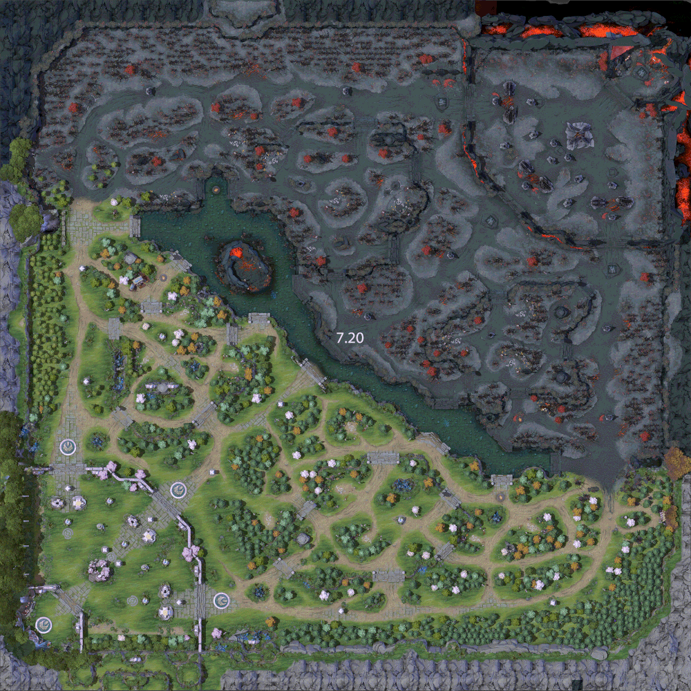

```{r setup, include=FALSE}
knitr::opts_chunk$set(echo = FALSE)

library(dplyr)
library(tidyverse)
library(knitr)

```

### Hintergrund und Ausgangssituation
[Dota 2](https://blog.dota2.com/ "Dota 2") ist ein teambasiertes Strategiespiel, in dem jeweils zwei Teams zu je fünf Spielern auf einem asymmetrisch aufgebauten Spielfeld gegeneinander antreten.<br>

Im Folgenden ist ein Bild eines Teamkampfes aus Partie 1 zwischen Team Aster und CDEC Gaming, der chinesischen DPL-CDA League Season 2 vom 08.07.2020 zu sehen. Da es lediglich der Veranschaulichung des Spiels dienen soll, gehe ich im folgenden nicht weiter auf die gezeigte Spielszene ein.


Vor Spielbeginn wird zufällig eines der beiden Teams ausgewählt. 
Das gewählte Team darf sich zwischen den zwei Seiten des Spielfeldes entscheiden.<br>
Die beiden Spielfeldhälften werden im Jargon als "Radiant" und "Dire" bezeichnet.
Im E-Sport-Bereich werden reguläre Spiele im Best-of-3 Format ausgetragen, d.h. jedes Spiel besteht aus maximal 3 Partien bzw. Matches.
Gewinner des Spiels ist das Team, dass zwei Matches für sich entscheiden kann. Ausnahmen bilden nur Qualifizierungsspiele (Best-of-1), die jeweils ersten Spiele der, nach der Qualifizierung 9. bis 16. Platzierten (Best-of-1) und Finalspiele (Best-of-5).<br>
Nach jedem beendeten Match wechseln die Teams auf die jeweils andere Seite des Spielfeldes.<br>
Die meisten Veranstalter orientieren sich hierbei an den Regeln von "The International", der jährlichen Weltmeisterschaft, nachzulesen auf "http://www.dota2.com/international/rules?l=english".

Die Asymmetrie äußert sich in subtilen Unterschieden, die je nach Spielverlauf und Spieldauer für das Team auf der jeweiligen Seite positive oder negative Auswirkungen haben kann. <br>
Die Spieldauer wird maßgeblich durch die am Anfang getroffene Auswahl der Spielfiguren beeinflusst (dem sog. Draft), da es je nach Auswahl und Teamkomposition vorteilhaft sein kann, das Match in einer Art Zermürbungsstrategie weiter hinauszuzögern (50 Minuten Dauer oder länger) oder möglichst aggressiv zu spielen, um die Partie schnellstmöglich (um die 20-Minuten-Marke) enden zu lassen.<br>
Während der Draft-Phase ist den Teams bereits bekannt, auf welcher Seite sie spielen werden.

Hier eine Übersicht aller 120 Spielfiguren (im Jargon auch als Heroes bezeichnet), aus denen die Teams während des Drafts wählen können.


In die Betrachtung werden ausschließlich Erstliga-Spiele ab dem 13.12.2016 einfließen.<br>
Dies begründet sich zum einen darin, dass professionelle Spieler besser in der Lage sind, kleine Vorteile auszunutzen und auszubauen, als Amateur-Spieler, und die Statistik somit aussagekräftiger wird.<br>
Zum anderen wurde dieser bestimmte Zeitpunkt ausgewählt, da an diesem Datum das letzte Update für Dota 2 veröffentlicht wurde, das größere Änderungen am Spielfeld mit sich gebracht hat. <br>
Alle seither ausgetragenen Partien sind daher für die Betrachtung relevant.

Das folgende GIF dient der Veranschaulichung von Spielfeldänderungen zwischen den Versionen 7.20 und 7.23.
Einige Pfade wurden leicht verändert, Bereiche verengt, andere ausgeweitet, Gebäude wurden leicht verschoben, Baumpositionen verändert und die Höhe einiger Orte verändert. Ebenso wurden strategische Schlüsselpositionen leicht verändert und optische Änderungen vorgenommen.


### Ziele und Vermutungen
Die Analyse soll schlussendlich dazu befähigen, u.a. folgende Fragestellungen beantworten und die Antworten mit statistischen Belegen untermauern zu können:

* "Welche der beiden Seiten "Radiant" und "Dire" befindet sich zu einem gegebenen Zeitpunkt statistisch gesehen im Vorteil?"

* "Ist es für Teams sinnvoll, den Draft an die zugewiesenen Spielhälfte anzupassen? Welche Strategie (Spielfluss hinauszögern oder beschleunigen) sollten "Radiant" und "Dire" verfolgen, um ihre Gewinnchancen zu maximieren?"

* "Sollten Teams, die besonders gut oder besonders schlecht mit einem be- oder entschleunigten Spielfluss umgehen, sich für eine bestimmte Seite entscheiden, um ihre Gewinnchancen zu maximieren?"

* Ausgehend von Erfahrungswerten kann vermutet werden, dass Radiant insgesamt eine etwas höhere Siegchance hat und sich dies vorallem in kurzen Spielen zeigt.

### Beschreibung der Daten
Die Daten stammen von der Webseite https://www.opendota.com, die zu statistischen Zwecken Spieldaten aus Dota 2 sammelt und diese über ein öffentliches API zur Verfügung stellt. 

Untersucht wird ein Datensatz von sämtlichen, seit dem 13.12.2016, im professionellen Bereich gespielten Partien (bzw. Matches).

Hierfür wurden unter der Adresse "https://www.opendota.com/explorer?" mit der folgenden SQL Query alle relevanten Partien ausgeben:

```{r eval=FALSE, echo = TRUE}
SELECT
duration AS time,
matches.match_id,
matches.start_time,
matches.radiant_win AS "did_rad_win?"
FROM matches
JOIN match_patch using(match_id)
JOIN leagues using(leagueid)
WHERE duration IS NOT NULL 
AND matches.start_time >= extract(epoch from timestamp '2016-12-13T23:00:00.000Z')
AND leagues.tier = 'professional'
GROUP BY matches.match_id
ORDER BY duration DESC NULLS LAST
```

Die Abfrage liefert etwa 40.000 professionelle Matches, (d.h. gespielt in der 1. Liga), beginnend ab dem 13.12.2016, ihre Match_ID als unique identifier, ihren Startzeitpunkt, die Spieldauer sowie, welche Seite gewonnen hat.

Die Spieldauer liegt als ganzzahlige Sekunden vor, während der Startzeitpunkt als Unixzeit gespeichert wurde. Welche Seite gewonnen hat sieht man anhand eines Boolean Wertes, der Wahr wird, wenn Radiant gewinnt oder aber Falsch, falls Dire gewinnt.

Die Daten können als CSV oder JSON heruntergeladen werden.

Im Folgenden ein Beispielauszug aus dem Datensatz:
```{r load opendota}
load("opendota.RData")
set.seed(42)
table <- opendota[sample(nrow(opendota), 10), ]
row.names(table) <- NULL
kable(table, caption = "Ein Beispielauszug")

```

### Analyse

Im folgenden Graphen wurden Zeitintervalle von 1 Minute festgelegt und die Anzahl der Siege sowie die Anzahl der Matches für jede Minute jeweils aufsummiert. 

Die Siegrate von Radiant wird durch das Dividieren der Siege durch die Anzahl der Matches für jede Minute einzeln berechnet.

Der Graph zeigt bereits einen Vorteil für die Radiant-Seite in der Anfangsphase des Spiels. Ab der 28. Minute scheint die Siegrate ausgeglichen, wobei sich ca. ab der 60. Minute eine Tendenz in Richtung Dire abzeichnet.

In den ersten 10 Minuten des Spiels und etwa ab der 75. Minute scheint die Datenmenge allerdings so gering zu sein, dass hier keine sinnvollen Schlussfolgerungen getroffen werden können.
```{r}
#Zeitintervalle von 1 Minute festlegen und Anzahl der Siege und Matches speichern
df1 <- opendota %>%
  group_by(minute = findInterval(time, seq(min(0), max(9000), 60))) %>%
  summarise(Anzahl = n(), 
            RadiantWon = sum(`did_rad_win?`))
plot1 <- ggplot(data = df1, aes(x = minute, y = RadiantWon/Anzahl)) + geom_line()
plot1 <- plot1 + labs(x = "Minuten", y = "Radiant Siegrate", title = "Siegrate, Spiele nach Minuten gruppiert")
plot1

```

Der obige Graph als Scatterplot:<br>
```{r}
plot2 <- ggplot(data = df1, aes(x = minute, y = RadiantWon/Anzahl)) + geom_point()
plot2 <- plot2 + labs(x = "Minuten", y = "Radiant Siegrate", title = "Siegrate, Spiele nach Minuten gruppiert")
plot2
```

Da zuvor die Datenmenge zu manchen Minutenzahlen zu gering war, um sinnvolle Schlussfolgerungen treffen zu können, wird nun ein Grenzwert von 25 Partien festgelegt. Nun werden nur noch Punkte ausgewertet, deren Partienzahl über dem Grenzwert liegen.

Desweiteren wurde ein Farbgradient hinzugefügt, um die Zahl der Partien, welche die Siegrate verifizieren, visuell darzustellen.
```{r}
#Grenzwerte entfernt, Farbcodierung 
df2 <- subset(df1, Anzahl>25)
plot3 <- ggplot(data = df2, aes(x = minute, y = RadiantWon/Anzahl, col = Anzahl)) + geom_line()  + scale_color_gradient(low='blue', high='red')
plot3 <- plot3 + labs(x = "Minuten", y = "Radiant Siegrate", title = "Siegrate ohne Ausreißer, Anzahl Partien farbcodiert")
plot3

```

Hier noch einmal als Scatterplot:

```{r}

#Grenzwerte entfernt, Farbcodierung  (geom_points)
plot4 <- ggplot(aes(x=minute, y=RadiantWon/Anzahl, col=Anzahl), data=df2) +
geom_point() +
scale_color_gradient(low='blue', high='red')
plot4 <- plot4 + labs(x = "Minuten", y = "Radiant Siegrate", title = "Siegrate ohne Ausreißer, Anzahl Partien farbcodiert")
plot4

```

Als Alternative für den Farbgradienten nun eine Darstellungsweise mit einem Säulendiagramm für die Anzahl.

Während die x-Achse sowohl für die Linie als auch für die Säulen die Minuten repräsentieren, stellt die y-Achse im Fall der Linie die Siegrate der Radiant-Seite und bei den Säulen die Anzahl der Partien im Verhältnis zu allen Partien dar. Die Skala stimmt aber weiterhin überein.
```{r}
#Bars für Anzahl Matches
plot5 <- ggplot(data = df2) + geom_line(data = df2, mapping = aes(x = minute, y = RadiantWon/Anzahl)) + geom_bar(data = df2, stat="identity", mapping = aes(x = minute, y = Anzahl/sum(Anzahl)), )
plot5 <- plot5 + labs(x = "Minuten", y = "Radiant Siegrate | Anteil der Partien", title = "Siegrate, Anzahl der Partien als Säulendiagramm")
plot5

```

Beim vorherigen Säulendiagramm waren die Verhältnisse bezüglich der Partiezahl nicht besonders gut zu erkennen, deswegen wird eine zweite Skala für die Säulen eingeführt, welche sie um den Faktor 10 vergrößert.
```{r}
#Bars für Anzahl Matches Faktor 10
plot6 <- ggplot(data = df2) + geom_line(data = df2, mapping = aes(x = minute, y = RadiantWon/Anzahl)) + geom_bar(data = df2, stat="identity", mapping = aes(x = minute, y = Anzahl/sum(Anzahl)*10), )+
  scale_y_continuous(
    "Radiant Siegrate", 
    sec.axis = sec_axis(~ . * 0.1, name = "Anteil Partien")
  )
plot6 <- plot6 + labs(x = "Minuten", y = "Radiant Siegrate", title = "Siegrate, Anzahl der Partien als Säulendiagramm (Faktor 10)")
plot6

```

Es wird deutlich, dass bereits ein großer Anteil der Partien zwischen der 22. und 27. Minute enden, wo die Radiant-Seite eindeutig über einen leichten Vorteil verfügt.
Das Maximum bezüglich der Anzahl der Partien scheint aber nahezu ausgeglichen, vielleicht noch mit einem minimalen Vorteil für Radiant.

Ab der 36. Minute fällt die Anzahl der Partien zwar wieder ab, es scheinen aber insgesamt mehr nach der 36. Minute zu enden als vor der 27. Minute. 

Bezüglich der Siegrate gewinnt die Dire-Seite ab diesem Zeitpunkt auch langsam an Vorteil. Der Unterschied in der Siegrate ist zwar weniger stark ausgeprägt als am in den ersten 27 Minuten, könnte aber durch eine höhere Anzahl an Partien wieder ausgeglichen werden.

#### Regressionsgerade

Im Folgenden wird mithilfe linearer Regression eine Gerade gebildet, um eine Funktion der Siegrate in Abhängigkeit der Minutenzahl herzuleiten.

Hierfür werden die selben Daten wie beim ersten Scatterplot verwendet. Damit die Anzahl der Partien aber entsprechend in die Regression mit einfließt, wird jeder Punkt "n" mal generiert, wobei "n" der Anzahl der Partien in dieser Minute entspricht. 

Dies ist im Scatterplot allerdings nicht zu sehen, da die Punkte eine identische Lage im Graph haben.

```{r}
#Regressionsgerade summary
df3 <- uncount(df1, weights = df1$Anzahl)
linearRegression <- lm(RadiantWon ~ minute, data = df3)
summary(linearRegression)

```

Die Residuen liegen weit auseinander und R² deutet mit einem Wert von 0.2624 auf einen nur geringen linearen Zusammenhang hin.

Insgesamt scheint die Gerade nicht besonders aussagekräftig, zeigt aber ebenfalls einen Vorteil für Radiant zu Beginn der Partie und einen Nachteil gegen Ende, wobei die 50% Marke etwa bei der 46. Minute erreicht wird.
```{r}
#Regressionsgerade plot
plot7 <- ggplot(data = df3, aes(x = minute, y = RadiantWon/Anzahl)) + geom_point() + geom_smooth(method = "lm", se = TRUE)
plot7 <- plot7 + labs(x = "Minuten", y = "Radiant Siegrate", title = "Siegesrate, lineare Regression")
plot7

```

Nun werden wieder die Ausreißer mit einem Grenzwert von 25 oder weniger Partien entfernt.

```{r}

df4 <- uncount(df2, weights = df2$Anzahl)
linearRegression <- lm(RadiantWon ~ minute, data = df4)
summary(linearRegression)

```

Die neue Gerade scheint minimal aussagekräftiger. 

Die Steigung scheint sich nicht wirklich verändert zu haben, der Schnittpunkt mit der 50% Achse ist allerdings verschoben und liegt nun bei der 40. Minute.

```{r}

plot8 <- ggplot(data = df4, aes(x = minute, y = RadiantWon/Anzahl)) + geom_point() + geom_smooth(method = "lm", se = TRUE)
plot8 <- plot8 + labs(x = "Minuten", y = "Radiant Siegrate", title = "Siegesrate ohne Ausreißer, lineare Regression")
plot8

```

#### Quadratische Regression

Da ein lineares Regressionsmodell eher weniger Erfolg zeigte, wird nun ein quadratisches Modell angewandt.

```{r}
quadraticRegression <- lm(RadiantWon ~ minute + I(minute^2), data = df4)
summary(quadraticRegression)

```

Dieses Modell scheint mit einem R² Wert von 0.6417 bereits deutlich besser, ist aber immer noch nicht aussagekräftig. 
Die Vermutung, dass die aufwärts Krümmung bei der 50. Minute einen negativen Einfluss hat, liegt nahe.

```{r}
plot10 <- ggplot(data = df4, aes(x = minute, y = RadiantWon/Anzahl)) + geom_point() + stat_smooth(method = "lm",formula = y ~ x + I(x^2), se = TRUE)
plot10 <- plot10 + labs(x = "Minuten", y = "Radiant Siegrate", title = "Siegesrate ohne Ausreißer, quadratische Regression")
plot10

```

#### Kubische Regression

Aufgrund der Vermutung, dass die Aufwärtskrümmung des quadratischen Modells einen negativen Einfluss hat, dürfte ein kubisches Modell besser geeignet sein:

```{r}
cubicRegression <- lm(RadiantWon ~ poly(minute, 3, raw=TRUE), data = df4)
summary(cubicRegression)

```

Die kubische Regression zeigt mit einem R² Wert von 0.9315 einen starken kubischen Zusammenhang zwischen Siegrate und Minutenzahl.

Auch visuell scheint der neue Graph um einiges besser zu der Punktwolke zu passen.

Meine Vermutung, dass die Siegrate zunächst auf stark auf Seiten der Radiant ist, anschließend waagerecht entlang der 50% Linie verläuft und gegen Ende auf Seiten der Dire liegt, zeigt sich fast gänzlich bestätigt.
Der einzige Unterschied ist, dass die Waagerechte nach dem Regressionsmodell leicht die Dire-Seite bevorteilt.

```{r}
plot11 <- ggplot(data = df4, aes(x = minute, y = RadiantWon/Anzahl)) + geom_point() + stat_smooth(method = "lm",formula = y ~ poly(x, 3, raw=TRUE), se = TRUE)
plot11 <- plot11 + labs(x = "Minuten", y = "Radiant Siegrate", title = "Siegesrate ohne Ausreißer, kubische Regression")
plot11

```

#### Zeitliche Veränderung
Dass die Spiellänge einen Einfluss auf die Siegrate hat, ist nun bereits deutlich.

Aber hat sich dieses Verhältnis im Laufe der Zeit vielleicht geändert?

Es erscheint möglich, dass sich die Siegrate aufgrund von Veränderungen am Spiel und durch Updates stark verändert hat und inzwischen womöglich durchgehend näher an der 50%-Marke liegt, als noch Ende 2016.

Im folgenden Graphen sind daher die Siegraten-Verläufe aller Versionen, die seit dem 13.12.2016 Änderungen am Spielfeld vorgenommen haben.

Der 13.12.2016 war zwar die letzte Generalüberholung des Spielfelds, dennoch gab es kleinere Änderungen im Laufe der Zeit.

Betrachtet werden hierbei jeweils alle Partien zwischen dem Release des entsprechenden Updates und dem des nächsten mit einer Änderung des Spielfeldes.

```{r}
#weitere Kurven für zeitlichen Verlauf (2017 bis heute, patches)
#08.02.17 - Version 7.02 - Unixtime 1486508400
#15.05.17 - Version 7.06 - Unixtime 1494799200
#10.08.18 - Version 7.15 - Unixtime 1533852000
#19.11.18 - Version 7.20 - Unixtime 1542582000
#24.05.19 - Version 7.22 - Unixtime 1558648800

df5 <- opendota 
df5$Patch <- ifelse(df5$start_time<1486508400, 1, 
  ifelse(df5$start_time<1494799200, 2,
  ifelse(df5$start_time<1533852000, 3,
  ifelse(df5$start_time<1542582000, 4,
  ifelse(df5$start_time<1558648800, 5,
  ifelse(df5$start_time>1558648800, 6, 0))))))

df5 <- df5 %>%
   group_by(minute = findInterval(time, seq(min(0), max(9000), 60)), Patch) %>%
   summarise(Anzahl = n(), 
             RadiantWon = sum(`did_rad_win?`))
 df5 <- subset(df5, Anzahl>25)
 plot9 <- ggplot() + 
   geom_line(data = df5, aes(x = minute, y = RadiantWon/Anzahl), group = df5$Patch, col = df5$Patch, show.legend = TRUE) 

 plot9 <- plot9 + labs(x = "Minuten", y = "Radiant Siegrate", title = "
 24.05.19 - Version 7.22 - Violett, 
 19.11.18 - Version 7.20 - Türkis,
 10.08.18 - Version 7.15 - Blau,
 15.05.17 - Version 7.06 - Grün,
 08.02.17 - Version 7.02 - Rot,
 13.12.16 - Version 7.00 - Schwarz
 ")
 plot9


#(siegraten insgesamt jeweils dazu schreiben)

#avg match vom patch (zeit, winrate)

```

Insgesamt scheint sich am Verlauf der Siegrate nicht viel geändert zu haben.

Die meisten Ausreißer sind auf geringe Partiezahlen zurückzuführen. Es ist auch deutlich erkennbar, dass längere Zeiträume zu flacheren Verläufen führen, so ist die violette Linie (Zeitraum von einem Jahr) meist mittig von den Ausreißern der anderen Verläufe.

Die schwarze Linie hat die stärksten Ausreißer, beschränkt sich allerdings auch auf einen Zeitraum von nur zwei Monaten. 

Hier fallen sogar einige Punkte im Bereich 30. bis 50. Minute weg, weil der Grenzwert von 25 Partien unterschritten wurde.

Die 85% Siegrate bei der 45. Minute basieren auch nur auf 27 Partien und scheint eher Zufall gewesen zu sein.

Abgesehen von einzelnen Ausreißern scheint die größte Differenz im Bereich 50. Minute und später zu liegen, wobei auch hier die Partiezahlen wieder recht gering sind.


### Ausblick, Resumé

#### Zusammenfassung

Zusammenfassend lässt sich sagen, dass es einen Zusammenhang zwischen Spieldauer und Siegrate gibt.

Selbst bei großen Datenmengen ist die Radiant-Seite bis etwa zur 37. Minute im Vorteil, danach die Dire-Seite. 

Die 27. bis 45. Minute sind aber noch recht nah an den 50% (maximal 4% entfernt).

Der Vorteil der Radiant-Seite ist stärker ausgeprägt als der, der Dire-Seite aber potentiell kürzer.

#### Beantwortung der Zielfragestellungen

***"Welche der beiden Seiten "Radiant" und "Dire" befindet sich zu einem gegebenen Zeitpunkt statistisch gesehen im Vorteil?"***

Vor der 37. Minute ist die Radiant-Seite im Vorteil, danach die Dire-Seite.

***"Ist es für Teams sinnvoll, den Draft an die zugewiesenen Spielhälfte anzupassen? Welche Strategie (Spielfluss hinauszögern oder beschleunigen) sollten "Radiant" und "Dire" verfolgen, um ihre Gewinnchancen zu maximieren?"***

Ja, insbesondere wenn man auf der Radiant-Seite spielt, ist es sinnvoll, im Draft Spielfiguren zu wählen die bereits früh einen Vorteil ausbauen und potentiell das Spiel gewinnen können. 

Die Dire-Seite sollte im Gegensatz dazu versuchen, keine zu großen Verluste in der Anfangsphase und in der Mitte des Spiels einzustecken und demnach Spielfiguren wählen, die das Spiel hinauszögern können und die Kontrolle über ihre Seite des Spielfeldes aufrechterhalten können.

***"Sollten Teams, die besonders gut oder besonders schlecht mit einem be- oder entschleunigten Spielfluss umgehen, sich für eine bestimmte Seite entscheiden, um ihre Gewinnchancen zu maximieren?"***

Ja, Teams die besonders gut mit einem beschleunigten Spielfluss umgehen können, sollten die Radiant-Seite priorisieren.

Teams die gut darin sind, Spiele hinaus zu zögern sollten hingegen eher die Dire-Seite wählen.

#### Wenn ich mehr Zeit hätte, würde ich:

- einen umfangreicheren Datensatz verwenden, der Berücksichtigung von mehr Faktoren als lediglich Siegwahrscheinlichkeit und Spieldauer zulässt.

- einzelne Spielfiguren (und dadurch auch Teamkompositionen) numerisch hinsichtlich ihrer Synergien bewerten und diese z.B. in Form von Radardiagrammen visualisieren.

- die Grafik unter "Zeitliche Veränderung" mit einem Steuerelement mit Ein/Ausschaltern für die einzelnen Graphen versehen, um die Lesbarkeit zu verbessern.

##### Werkzeuge

R-Studio: Hat Pakete und Funktionen für alles, was ich machen wollte. 
Das Kompilieren zu einer HTML Datei kann aber recht lange dauern.

Opendota Explorer: Sehr gutes Tool um sich Dota Datensätze generieren zu lassen.
Werden die SQL Statements zu komplex kommt es aber zu Timeouts.

##### Andere Ansätze

Rückblickend würde ich die selben Ansätze verwenden. <br>
Da ich meinen Datensatz selbst zusammenstellen konnte, bin ich mit diesem sehr zufrieden. R-Studio verfügt über alle von mir benötigten Funktionen und Pakete, auch wenn diese teils eine gewisse Einarbeitungszeit erfordern.

##### Verworfene Lösungsansätze

Lösungsansätze wurden nicht gänzlich verworfen, bedurften aber teilweise kleinerer Überarbeitungen, um zu aussagekräftigen Ergebnissen zu kommen. <br>
Die Regressionsrechnung beispielsweise spiegelte zunächst nicht die Gewichtung in Form der Menge an Daten an jedem Punkt wieder.


#### Quellen 

Opendota, "https://www.opendota.com/explorer?", Abgerufen am 05.07.2020

The International Regeln, "http://www.dota2.com/international/rules?l=english", Abgerufen am 08.07.2020

Dota 2, "https://blog.dota2.com/", Abgerufen am 08.07.2020

Versionsnummern der Spielfeldänderungen, "https://dota2.gamepedia.com/Map", Abgerufen am 07.07.2020

Dota 2 Hauptmenü, Heldenübersicht, Abgerufen am 08.07.2020

Dota 2 Zuschauermodus, Team Aster vs CDEC Gaming, DPL-CDA Season 2, Abgerufen am 08.07.20

Vergleich des Spielfeldes zwischen 2 Versionen, "https://images.squarespace-cdn.com/content/v1/59af2189c534a58c97bd63b3/1575312455290-6TFN43BWDPN7OJ13SNHG/ke17ZwdGBToddI8pDm48kPJXHKy2-mnvrsdpGQjlhod7gQa3H78H3Y0txjaiv_0fDoOvxcdMmMKkDsyUqMSsMWxHk725yiiHCCLfrh8O1z5QHyNOqBUUEtDDsRWrJLTmNhTL1csF4IG5y-qj70Wo08mNhyC0Li-nnGmSWmu-RPzBQHhRD1i-jLysqaC42N26/720+and+723+map+comparison+Dota+2.gif", Abgerufen am 08.07.20


##### Arbeitsaufwand

etwa 30 Stunden
